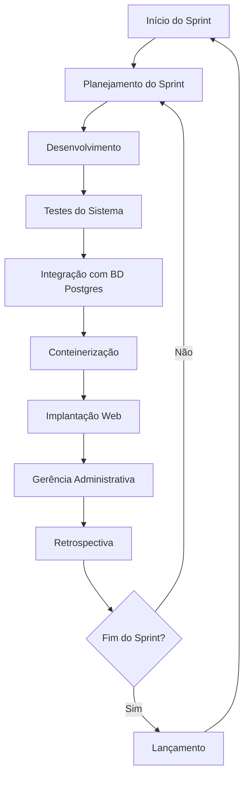
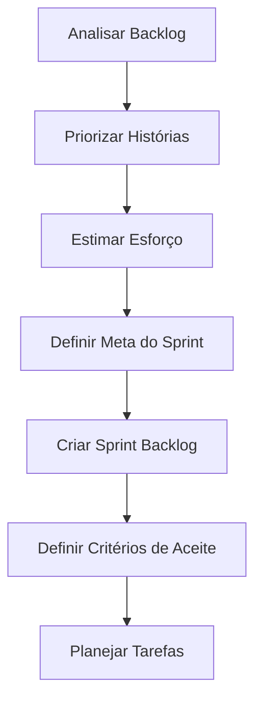
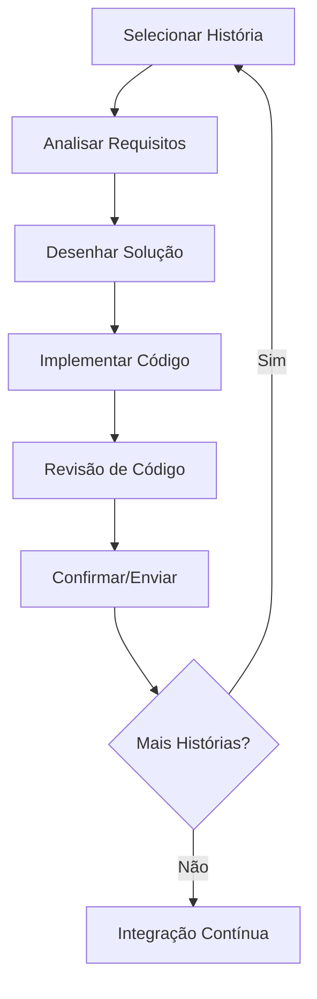
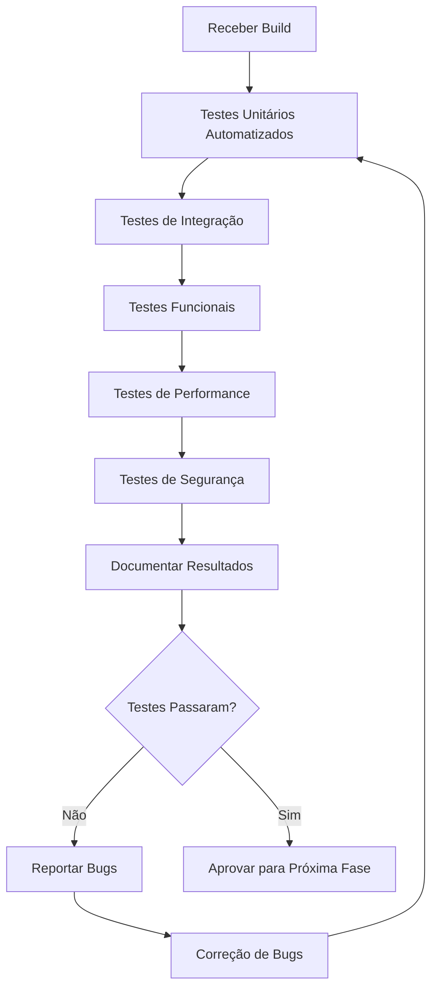
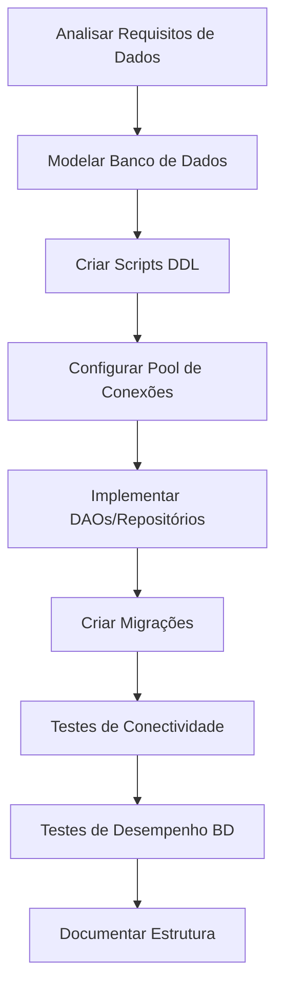
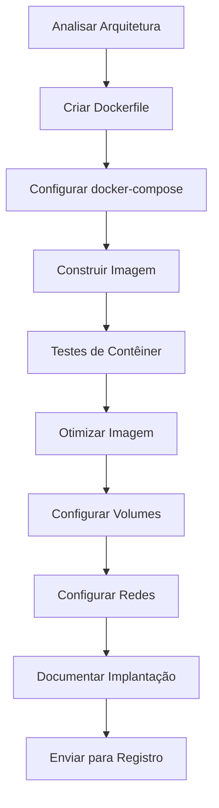
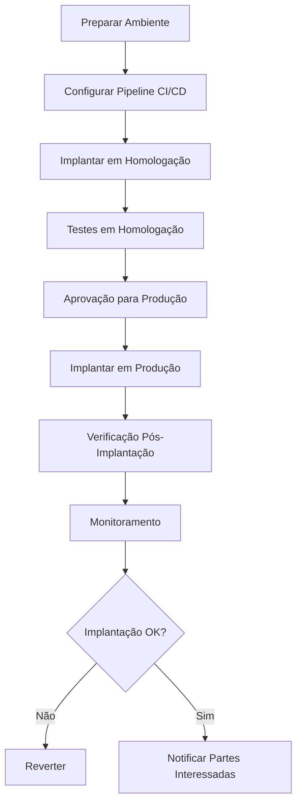
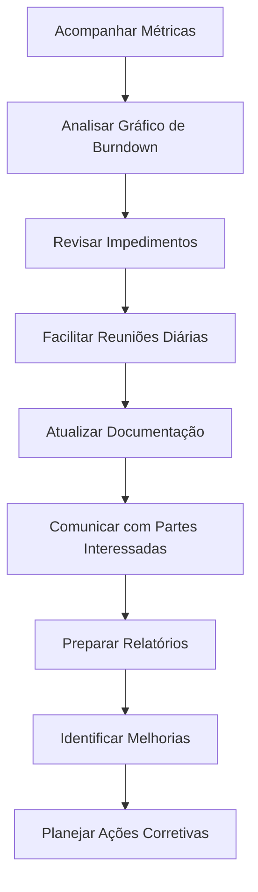

# Processo Ágil - PDS Corporativo

## 1. Visão Geral do Processo

Este documento define um processo ágil para desenvolvimento de software no contexto do PDS Corporativo, incluindo atividades de gerência, testes e implantação.

## 2. Diagrama Geral do Ciclo de Vida

## 3. Diagramas Detalhados por Atividade

### 3.1 Planejamento do Sprint

**Responsável:** Toda a equipe (Equipe Scrum)

**Práticas Ágeis:**
- Reunião de Planejamento do Sprint
- Pontos de História
- Definição de Pronto para Desenvolvimento

### 3.2 Desenvolvimento de Funcionalidades

**Responsável:** Toda a equipe (Desenvolvedores)

**Práticas Ágeis:**
- Programação em Pares
- Desenvolvimento Orientado por Testes
- Integração Contínua
- Revisão de Código
- Fluxo Git

### 3.3 Testes do Sistema

**Responsável:** Luiz Felipe Pinheiro Lopes

**Práticas Ágeis:**
- Automação de Testes
- Testes Contínuos

### 3.4 Conectar ao Banco de Dados Postgres

**Responsável:** Luiz Felipe Pinheiro Lopes

**Práticas Ágeis:**
- Versionamento de Banco de Dados
- Testes Automatizados de Banco de Dados
- Refatoração de Banco de Dados
- Integração Contínua de Banco de Dados

### 3.5 Conteinerização do Sistema

**Responsável:** Samuel

**Práticas Ágeis:**
- Infraestrutura como Código
- Orquestração de Contêineres
- Implantação Automatizada
- Paridade de Ambientes
- Infraestrutura Imutável

### 3.6 Implantação na Web

**Responsável:** Luiz Felipe Pinheiro Lopes

### 3.7 Gerência Administrativa

**Responsável:** Samuel

**Práticas Ágeis:**
- Reuniões Diárias
- Revisão do Sprint
- Retrospectiva do Sprint
- Gráficos de Burndown
- Acompanhamento de Velocidade
- Melhoria Contínua

## 4. Papéis e Responsabilidades

| Papel | Responsável | Atividades Principais |
|-------|-------------|----------------------|
| **Testador/Garantia de Qualidade** | Luiz Felipe Pinheiro Lopes | Testes do Sistema, Integração BD |
| **Engenheiro DevOps** | Samuel | Conteinerização, Gerência |
| **Desenvolvedor/Implantação** | Luiz Felipe Pinheiro Lopes | Implantação Web |
| **Equipe Scrum** | Toda a equipe | Desenvolvimento, Planejamento |

## 5. Práticas Ágeis por Categoria

### 5.1 Desenvolvimento
- **Programação em Pares:** Desenvolvimento colaborativo
- **Refatoração:** Melhoria contínua do código
- **Revisão de Código:** Revisão de código por pares

### 5.2 Testes
- **Automação de Testes:** Automatização de testes
- **Testes Contínuos:** Testes contínuos no pipeline

### 5.3 DevOps
- **CI/CD:** Integração e entrega contínua
- **Infraestrutura como Código:** Infraestrutura como código
- **Orquestração de Contêineres:** Orquestração de contêineres
- **Monitoramento:** Monitoramento contínuo

### 5.4 Gerência
- **Planejamento de Sprint:** Planejamento de sprint
- **Reuniões Diárias:** Reuniões diárias
- **Revisão do Sprint:** Revisão do sprint
- **Retrospectiva do Sprint:** Retrospectiva para melhoria

## 6. Métricas e Indicadores

- **Velocidade:** Pontos entregues por sprint
- **Gráfico de Burndown:** Progresso do sprint
- **Tempo de Entrega:** Tempo de entrega das funcionalidades
- **Frequência de Implantação:** Frequência de implantações
- **Tempo Médio de Recuperação:** Tempo médio de recuperação
- **Cobertura de Testes:** Cobertura de testes

## 7. Ferramentas Recomendadas

- **Controle de Versão:** Git/GitHub
- **CI/CD:** GitHub Actions, Jenkins
- **Contêineres:** Docker, Kubernetes
- **Banco de Dados:** PostgreSQL
- **Monitoramento:** Prometheus, Grafana
- **Gestão:** Jira, Trello

---

*Processo desenvolvido para o PDS Corporativo - Versão 1.0*