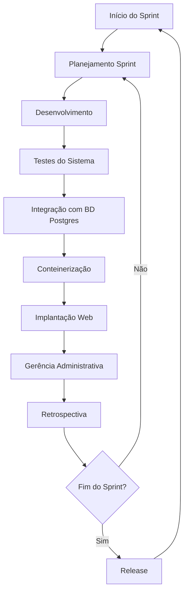
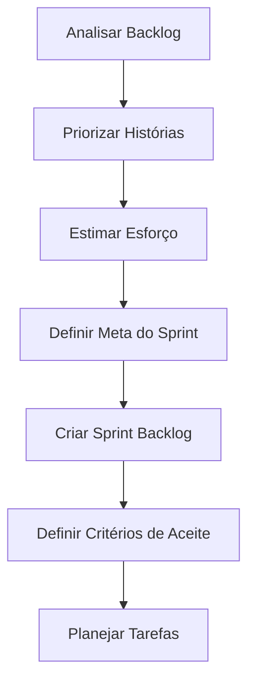
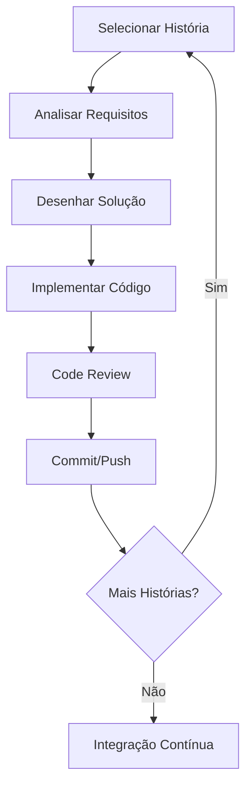
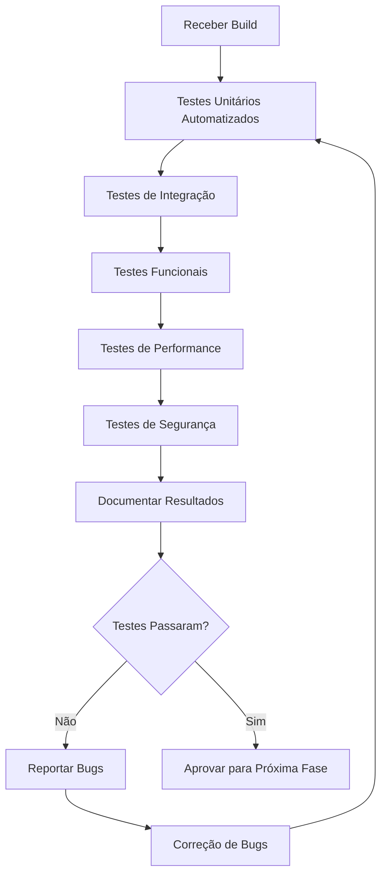
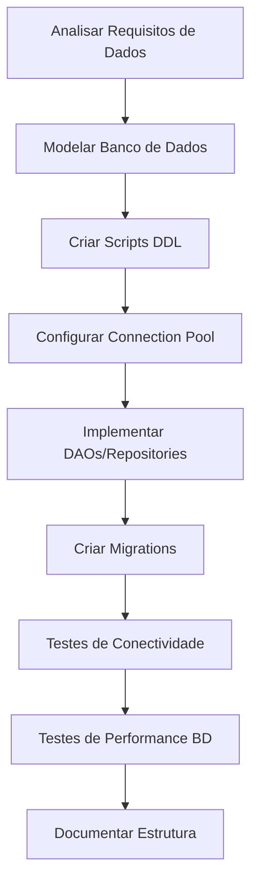
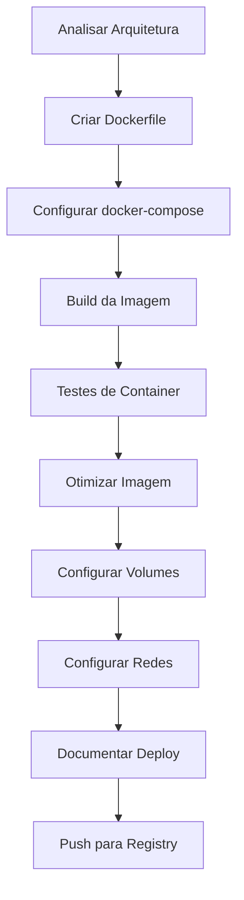
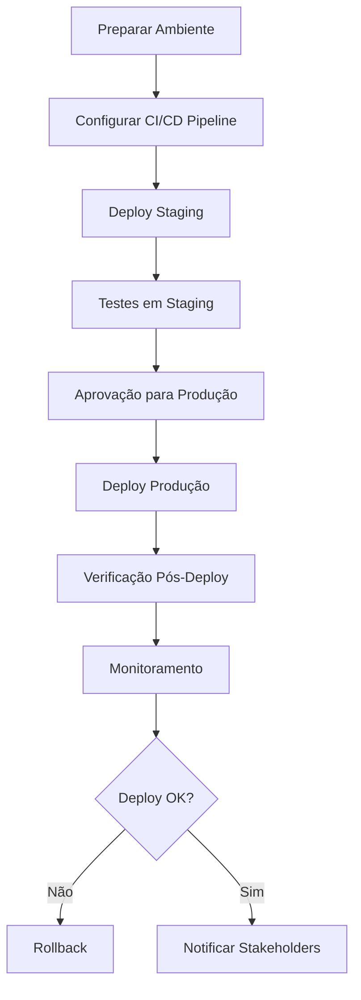
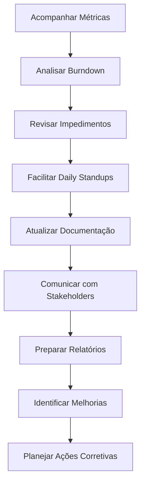

# Processo Ágil - PDS Corporativo

## 1. Visão Geral do Processo

Este documento define um processo ágil para desenvolvimento de software no contexto do PDS Corporativo, incluindo atividades de gerência, testes e implantação.

## 2. Diagrama Geral do Ciclo de Vida

## 3. Diagramas Detalhados por Atividade

### 3.1 Planejamento do Sprint

**Responsável:** Toda a equipe (Scrum Team)

**Práticas Ágeis:**
- Sprint Planning Meeting
- Story Points
- Planning Poker
- Definition of Ready

### 3.2 Desenvolvimento de Funcionalidades

**Responsável:** Toda a equipe (Desenvolvedores)

**Práticas Ágeis:**
- Pair Programming
- Test-Driven Development (TDD)
- Continuous Integration
- Code Review
- Git Flow

### 3.3 Testes do Sistema

**Responsável:** Luiz Felipe Pinheiro Lopes

**Práticas Ágeis:**
- Test Automation
- Continuous Testing
- Behavior-Driven Development (BDD)
- Test Coverage Analysis
- Regression Testing

### 3.4 Conectar ao Banco de Dados Postgres

**Responsável:** Luiz Felipe Pinheiro Lopes

**Práticas Ágeis:**
- Database Versioning
- Automated Database Testing
- Database Refactoring
- Continuous Database Integration

### 3.5 Conteinerização do Sistema

**Responsável:** Samuel

**Práticas Ágeis:**
- Infrastructure as Code
- Container Orchestration
- Automated Deployment
- Environment Parity
- Immutable Infrastructure

### 3.6 Implantação na Web

**Responsável:** Luiz Felipe Pinheiro Lopes

**Práticas Ágeis:**
- Continuous Deployment
- Blue-Green Deployment
- Canary Releases
- Automated Rollback
- Infrastructure Monitoring

### 3.7 Gerência Administrativa

**Responsável:** Samuel

**Práticas Ágeis:**
- Daily Standups
- Sprint Review
- Sprint Retrospective
- Burndown Charts
- Velocity Tracking
- Continuous Improvement

## 4. Papéis e Responsabilidades

| Papel | Responsável | Atividades Principais |
|-------|-------------|----------------------|
| **Testador/QA** | Luiz Felipe Pinheiro Lopes | Testes do Sistema, Integração BD |
| **DevOps Engineer** | Samuel | Conteinerização, Gerência |
| **Desenvolvedor/Deploy** | Luiz Felipe Pinheiro Lopes | Implantação Web |
| **Scrum Team** | Toda a equipe | Desenvolvimento, Planejamento |

## 5. Práticas Ágeis por Categoria

### 5.1 Desenvolvimento
- **Pair Programming:** Desenvolvimento colaborativo
- **TDD:** Test-Driven Development
- **Refactoring:** Melhoria contínua do código
- **Code Review:** Revisão de código por pares

### 5.2 Testes
- **Test Automation:** Automatização de testes
- **BDD:** Behavior-Driven Development
- **Continuous Testing:** Testes contínuos no pipeline

### 5.3 DevOps
- **CI/CD:** Integração e entrega contínua
- **Infrastructure as Code:** Infraestrutura como código
- **Container Orchestration:** Orquestração de containers
- **Monitoring:** Monitoramento contínuo

### 5.4 Gerência
- **Sprint Planning:** Planejamento de sprint
- **Daily Standups:** Reuniões diárias
- **Sprint Review:** Revisão do sprint
- **Sprint Retrospective:** Retrospectiva para melhoria

## 6. Métricas e Indicadores

- **Velocity:** Pontos entregues por sprint
- **Burndown Chart:** Progresso do sprint
- **Lead Time:** Tempo de entrega das funcionalidades
- **Deployment Frequency:** Frequência de deploys
- **Mean Time to Recovery:** Tempo médio de recuperação
- **Test Coverage:** Cobertura de testes

## 7. Ferramentas Recomendadas

- **Versionamento:** Git/GitHub
- **CI/CD:** GitHub Actions, Jenkins
- **Containers:** Docker, Kubernetes
- **Banco de Dados:** PostgreSQL
- **Monitoramento:** Prometheus, Grafana
- **Gestão:** Jira, Trello

---

*Processo desenvolvido para o PDS Corporativo - Versão 1.0*